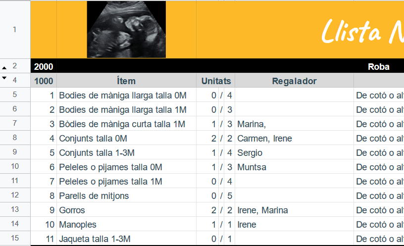

# Baby wish list

This an attempt to make a Wishlist for your new Babyborn.

## Backend (?)
My wife and I didn't want to make an online list with referral links. So I started my RaspberryPi in home and started installing
docker with [N8N](https://n8n.io/) and [traefik](https://traefik.io/) as a Backend Server.

The original idea was to use Google Spreadsheets as database (terrible idea but convenient).

I also use [Redis](https://redis.io/) for caching the list and not make a request to GDocs every single time anyone check the website.

## Frontend

I think is my first time using React for a "real world problem" (I normally don't code in anything in frontend, and right now i'm a mobile developer so... D:).

As UI-Kit i'm using [ChakraUI](https://chakra-ui.com/).

## Deployment

This website is deployed in [netlify](https://www.netlify.com/).